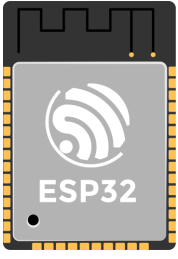
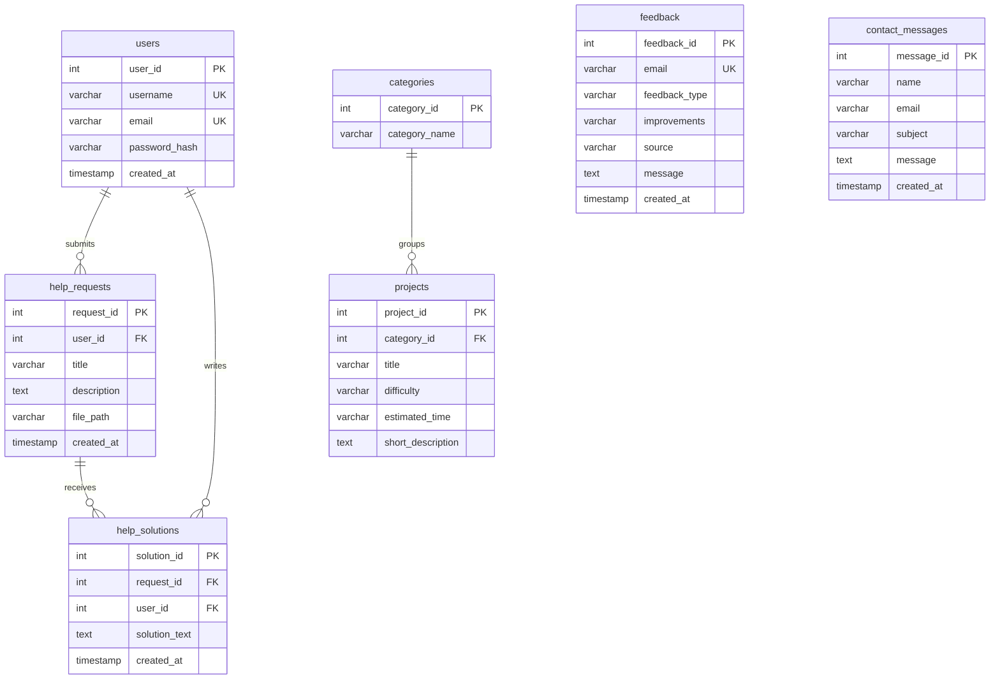

<p align="center">
  
</p>

<h1 align="center">ESP32 Hub</h1>

<p align="center">
  A PHP and MySQL web app where ESP32 beginners can browse learning projects, ask for help and share solutions.
</p>

<p align="center">
  
  
  
  
  
</p>

---

ESP32 Hub started as a static ESP32 guide and grew into a database-driven web app for the CPCS-403 final project at King Abdulaziz University. Information about the ESP32 is spread across many sites, so the goal was one place where learners can find starter projects, watch tutorials and ask questions.

**Live demo:** [esp32hub.infinityfree.me](https://esp32hub.infinityfree.me/pages/index.php)
**Full report:** [ESP32 - Hub.pdf](ESP32%20-%20Hub.pdf)

## Features

- **Accounts:** register, log in and log out. Protected pages redirect to the login page when there is no session.
- **Projects:** a catalogue of ESP32 learning projects grouped by category, with difficulty and estimated time. Logged-in users can add and delete projects.
- **Help requests:** users post a problem with an optional code file (`.ino`, `.c`, `.cpp`, `.txt`, `.py` or `.zip`, up to 2 MB). Others can reply with solutions, and the list shows how many solutions each request has.
- **Dashboard:** shows the logged-in user's own help requests.
- **Feedback form:** validated on the client with JavaScript and again on the server with PHP. Each email address can submit feedback once.
- **Contact form, gallery, tutorial videos and a printable resources table** (with its own print stylesheet).
- **Responsive layout** for desktop, tablet and phone, using flexbox, CSS grid and media queries.

## Database design

Seven tables in MySQL (InnoDB), linked with foreign keys:



The help list counts solutions per request with a `LEFT JOIN` and `GROUP BY`, so requests with no solutions still appear with a count of zero:

```sql
SELECT hr.request_id, hr.title, hr.created_at, u.username,
       COUNT(hs.solution_id) AS solution_count
FROM help_requests hr
JOIN users u ON hr.user_id = u.user_id
LEFT JOIN help_solutions hs ON hr.request_id = hs.request_id
GROUP BY hr.request_id, hr.title, hr.created_at, u.username
ORDER BY hr.created_at DESC;
```

The full schema and sample data are in [`esp32_hub_db.sql`](esp32_hub_db.sql).

## Security

- Passwords are hashed with `password_hash()` and checked with `password_verify()`.
- Every query that takes user input uses prepared statements with bound parameters.
- User content is escaped with `htmlspecialchars()` before it is displayed.
- Uploaded files are checked by extension and size, then saved under a unique generated name.
- `includes/auth_check.php` guards the pages that need a login.

## Running it locally

You need [XAMPP](https://www.apachefriends.org/) (or any Apache + PHP + MySQL setup).

1. Clone the repo into your web root:
   ```bash
   cd C:\xampp\htdocs
   git clone https://github.com/tariq-areesh/ESP32-Hub.git esp32-hub
   ```
2. Start **Apache** and **MySQL** from the XAMPP control panel.
3. Open [phpMyAdmin](http://localhost/phpmyadmin), create a database named `esp32_hub`, select it and import `esp32_hub_db.sql`.
4. If your MySQL user or password is not the XAMPP default (`root` with no password), edit `includes/db_connect.php`.
5. Open [localhost/esp32-hub](http://localhost/esp32-hub/).

## Project structure

```
esp32-hub/
├── index.php              entry point
├── esp32_hub_db.sql       schema and sample data
├── includes/              db connection, auth check, header, footer
├── pages/                 one PHP file per page
├── script/                validation.js, gallery.js
├── css/                   style.css, print.css
├── images/                UI and gallery images
├── videos/                tutorial videos
└── uploads/               files attached to help requests
```

## Authors

Built by **Tariq Mohammed Areesh** ([@tariq-areesh](https://github.com/tariq-areesh)) and **Majd Ahmed Al-farasani** for CPCS-403 at King Abdulaziz University, 2025.
